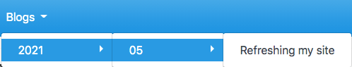

# Refreshing my site

I've decided to refresh this for a couple of reasons:

1. It looks a little tired.  Originally created doing it "my way", mainly as a "live CV".
1. I feel like I have something to contribute via blog posts.
1. Interested in including some user interaction/feedback.

## Choosing a site generator

My original site already worked from markdown files and I want to continue like this.  I pretty much write all my documentation
in markdown.  Here are the items I looked at:

- [Jekyll][jekyll-url]
- [MkDocs][mkdocs-url]
- [Material for MkDocs][material-url]

### Jekyll

Jekyll is a well established static site generator, with direct integration into github pages.  This seemed like the obvious
place to start as I'm going to host it on github-pages.

I quickly found that if you've worked with other site generators Jekyll can feel overly complex.  I suspect this is due to
flexibility, but for what I needed it was too much.  I also wasn't a big fan of the available themes.

### MkDocs

Full disclosure, I've used MkDocs before for my work at Sanger and I already know how to use it.

Quite simply if you want to provide a site that is easy to navigate all you need to do in MkDocs is structure things in
a document tree as you want to see it in the site menu:

```none
docs/
├── blogs
│   └── 2021
│       └── 05
│           └── updating-my-site.md
└── index.md
```



The above requires no configuration at all, but obviously you still want to do some.

Before I go further, I want my site to have a clean look and feel.  MkDocs has a limited number of themes, Read the Docs
isn't bad but there is an extension project which I recently used and have found it good.  As I'm leaning towards MkDocs
over Jekyll, lets take that next step before I get bogged down on layout and content...

### MkDocs Material

This was the selected tool (at time of writing).

As the title suggests, this is MkDocs focused on [Material Design][matrialio-url] components.

The first thing you notice when you apply the material theme is that you automatically get a left and right sidebar.  The left sidebar
gives you the site navigation, very similar to the document tree:


This will automatically change to a [hamburger menu button][wiki-burger] if the view is narrow.

On the right the table of content for the current document is shown.

## Interaction

As I'm thinking of writing blog posts semi-regularly it makes sense to give people the ability to interact via comments.

This is hosted in the GitHub eco-system and I don't really want to be pushing people to another service for comments so
I did a little digging and found [utterances][utterances-url].

This basically uses the repositories issue tracking system to allow comments, see it in action below.

## Comments

<script src="https://utteranc.es/client.js"
        repo="keiranmraine/keiranmraine.github.io"
        issue-term="url"
        label="comments"
        theme="boxy-light"
        crossorigin="anonymous"
        async>
</script>

<!-- refs -->

[jekyll-url]: https://jekyllrb.com/
[material-url]: https://squidfunk.github.io/mkdocs-material/
[matrialio-url]: https://material.io/
[mkdocs-url]: https://www.mkdocs.org/
[utterances-url]: https://utteranc.es/
[wiki-burger]: https://en.wikipedia.org/wiki/Hamburger_button
